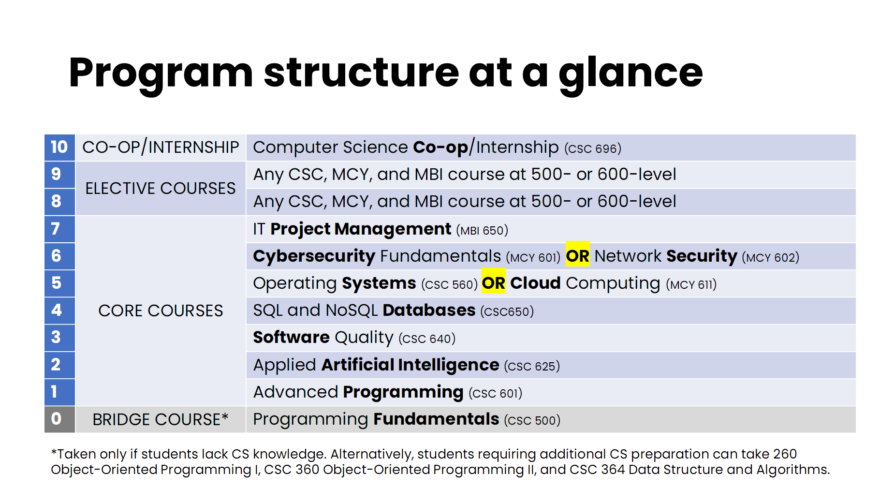

# NKU's Master's Program in Computer Science repository

Welcome to NKU's Master's Program in Computer Science (MSCS) repository. This repository is designed to help students learn more about the program and succeed.

## Resources

- **Program description**: visit the [MSCS program description page](./MSCS-program-description.md).
- **Course catalog**: https://www.nku.edu/admissions/graduate/current-students/Catalog.html
- **Frequently Asked Questions**: visit the [FAQ page](./FAQ.md)
